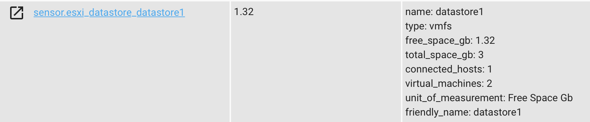
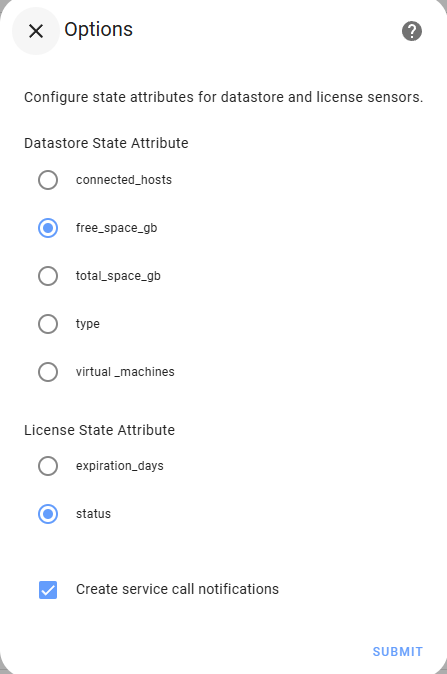
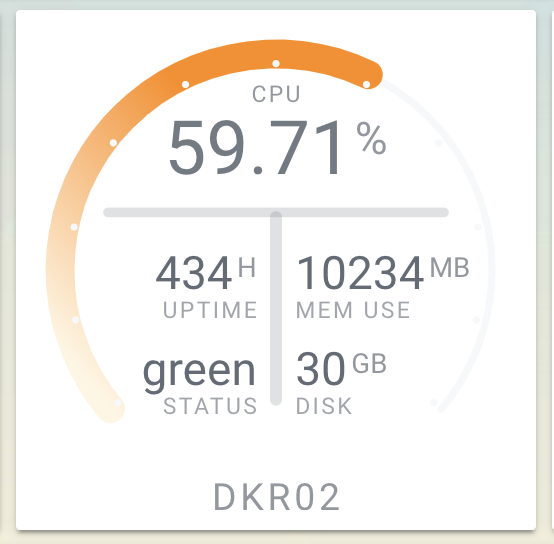

# ESXi Stats

[](https://github.com/hacs/integration)

- [Installation](#installation)
- [Configuration](#configuration-options)
- [Options](#sensor-states)
- [Service Calls](#service-calls)
- [Presenting Data in Home Assistant](#presenting-data-in-home-assistant)

ESXi component for Home Assistant
This component will gather stats from an ESXi server or vCenter. Information gathered can be Host, Datastore, License, and VM info. Information is gathered approximately every 45 seconds.
A sensor is created for each discovered monitored object (since release 0.5.0). The sensor state can be changed to suit your needs.

The component pulls the following information:

- Hosts (sensor.esxi_stats_hosts)

  - host name
  - host version
  - host uptime in hours
  - host cpu total in MHz (core speed \* # of cores)
  - host cpu usage in MHz
  - host memory total in GB
  - host memory usage in GB
  - host power policy
  - Number of VMs on host

- Datastores (sensor.esxi_stats_datastores)

  - Datastore name
  - Datastore type
  - Free space in GB
  - Total space in GB
  - Number of connected hosts
  - Number of residing VMs

- Liceses (sensor.esxi_stats_licenses)

  - License Status (OK, Expiring Soon if expiration is under 30 days, Expired)
  - License Name
  - Product Type
  - Expiration (in days, if any)
  - Host (to which this license is attached)

- Virtual Machines (sensor.esxi_stats_vms)
  - VM name
  - VM status (normal, warning, etc)
  - VM state (running, suspended, etc)
  - VM uptime in hours
  - Number of configured CPUs
  - CPU usage %
  - Configured memory in MB
  - Used memory in MB
  - Storage used in GB
  - VM Tools status (tools running, not running, not install, etc)
  - VM guest OS
  - VM guest IP address (if VM has multiple, only primary will be shown)
  - Number of snapshots

Sensor Example


## Installation

### HACS

1. Open HACS > Settings
2. In ADD CUSTOM REPOSITORY box paste this git's URL <https://github.com/wxt9861/esxi_stats> and select type Integration
3. Click INSTALL
4. Configure via Integrations page or Make necessary modifications to your configuration.yaml
5. Restart Home Assistant

### Manual install

1. Using the tool of choice open the directory (folder) for your HA configuration (where you find configuration.yaml).
2. If you do not have a custom_components directory (folder) there, you need to create it.
3. In the custom_components directory (folder) create a new folder called esxi_stats.
4. Download all the files from the custom_components/esxi_stats/ directory (folder) in this repository.
5. Place the files you downloaded in the new directory (folder) you created.
6. Add esxi_stats: to your HA configuration (see examples below)
7. Restart Home Assistant

## Configuration options

| Key                    | Type      | Required | Default | Description                                                                                                                                                                                                                                                                                                     |
| ---------------------- | --------- | -------- | ------- | --------------------------------------------------------------------------------------------------------------------------------------------------------------------------------------------------------------------------------------------------------------------------------------------------------------- |
| `host`                 | `string`  | `True`   | None    | ESXi host or vCenter                                                                                                                                                                                                                                                                                            |
| `username`             | `string`  | `True`   | None    | Username to ESXi host or vCenter                                                                                                                                                                                                                                                                                |
| `password`             | `string`  | `True`   | None    | Password to ESXi host or vCenter                                                                                                                                                                                                                                                                                |
| `verify_ssl`           | `boolean` | False    | False   | Leave at default if your ESXi host or vCenter is using a self-signed certificate (most likely scneario). Change to **true** if you replaced a self-signed certificate. If you're using a self-signed cert and set this to True, the component will not be able to establish a connection with the host/vcenter. |
| `monitored_conditions` | `list`    | False    | all  | What information do you want to get from the host/vcenter. Available options are **vmhost**, **datastore**, **license**, and **vm**                                                                                                                                                                             |

ESXi Stats can be configured via Integrations page or in yaml. While yaml is currently allowed, support is likely to be dropped in the future releases.

### Integration UI

1. From Home Assistant UI go to Confinguration > Integrations
2. Click the orange + icon at the bottom right to bring up new integration window
3. Find and click on ESXi Stats
4. Enter required information and click Submit

## Sensor States

You can control what attribute key each sensor type displays as a state. For example, you can set VM sensors to display their uptime as their sensor state.
To change the state of each sensor type:

1. From Home Assistant UI go to Configuration > Integrtions > ESXi Stats integation
2. In the upper right corner click on the gears icon to bring up the options menu
3. Enter the attribute you want displayed as the state
4. Restart HASS



To enable debug

```yaml
logger:
  logs:
    custom_components.esxi_stats: debug
```

## Service Calls

Service calls are only available with a full ESXi license. On start up the component will scan available licenses and register services only if a compatible license is found.

To issue a command:

1. Select the service from the Development Tools > Services > Service dropdown
2. Enter required data

The following serivces are available:

- **esxi_stats.host_power_policy** - set Power Policy on a VM Host
  - Issuing this service against a vCenter with multiple hosts will **not** execute the command at this time.
  - Power policy name shown in the ESXi/vCenter GUI does not match what ESXi host expects as input. You will need to figure out what Power Policies are availble on your host. One way to do that is to issue a service call with a random command string (like **test**). This will return a warning in Home Assistant log indicating that your selection is not valid, but will also display available policy names.
  - Generic policies can be:
    - **static** - High performance
    - **dynamic** - Balanced
    - **low** - Low power
    - **custom** - Custom

  ```json
  { "host":"host/vCenter", "command":"power_policy_name"}
  ````

- **esxi_stats.vm_power** - on,off,reboot,reset,shutdown,suspend a VM

  ```json
  { "host":"host/vCenter", "vm": "vm_name", "command": "suspend" }
  ```

- **esxi_stats.create_snapshot** - create a VM snapshot

  - Snapshots can be created with/without memory dump and with/without quiescing a file system. Defaults are to snapshot without memory and quiesce.
  - Minimum required parameters are **vm** and **name**

  ```json
  { "host":"host/vCenter", "vm": "vm_name", "name": "snapshot before upgrde" }
  ```

  - Optional parameters are **description**, **memory**, and **quiesce**
  - If no description is specified, a default description will be added to indicate that the snapshot was taken from HomeAssistant

  ```json
  {
    "host": "host/vCenter",
    "vm": "vm_name",
    "name": "snapshot before upgrade",
    "memory": true,
    "quiesce": true
  }
  ```

- **esxi_stats.remove_snapshot** - remove **all** or **first**/**last** snapshot in a snapshot tree

  - This is a work in progress, once I figure out how to better handle multiple snapshots, only basic options are available

  ```json
  { "host": "host/vCenter", "vm": "vm_name", "command": "all" }
  ```

Some commands provide status (ex. suspending a VM or resuming a VM), while other commands are fire and forget (ex. reboot/shutdown). Commands that provide status will output info messages to logger and create a persistent notification when they are complete.

**When executing commands, understand what each command does**
(ex. to gracefully shutdown, send a **shutdown** command not an **off** command)

## Presenting Data in Home Assistant

A custom lovelace card would be ideal, but for now I explored existing available tools since I'm not too thrilled about diving into creating custom cards

- You can break out the data into seperate sensors
  - See home-assistant documentation
- Use [Custom flex-table-card](https://github.com/custom-cards/flex-table-card)
  - Example lovelace yaml can be found [here](examples/flex-table-card-example.yaml)
  - 
- Use [Custom flex-horseshoe-card](https://github.com/AmoebeLabs/flex-horseshoe-card) paired with [Custom decluttering-card](https://github.com/custom-cards/decluttering-card)
  - Example lovelace yaml can be found [here](examples/flex-horseshoe-card/ui-lovelace.yaml)
  - This example is valid for flex-horseshoe-card 0.8.2 and declutering-card 0.2.0
  - 
- Use [Custom button-card](https://github.com/custom-cards/button-card)
  - Example lovelace yaml can be found [here](examples/button-card-example.yaml)
  -  
