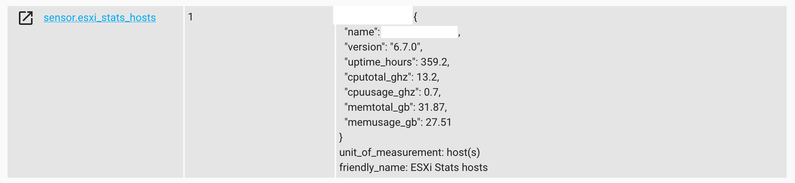
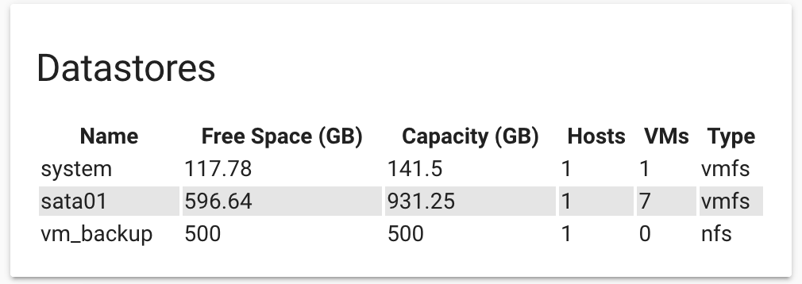
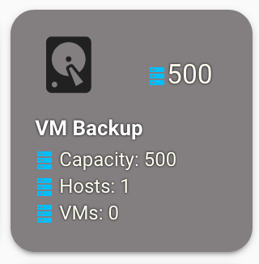
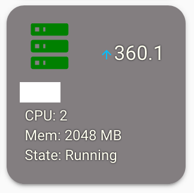

# ESXi Stats

ESXi component for Home Assistant
This component will gather stats from an ESXi server or vCenter. Information gathered can be Host info, Datastore info and VM info. Information is gathered every 60 seconds.
A sensor is created for each monitored condition. If you're monitoring hosts, datastores, and vms, 3 sensors are createad. Stats are stored as sensor attributes and can be retreieved using various tools available for Home Assistant.

The component pulls the following information:

- Hosts (sensor.esxi_stats_hosts)
  - host name
  - host version
  - host uptime in hours
  - host cpu total in MHz (core speed \* # of cores)
  - host cpu usage in MHz
  - host memory total in GB
  - host memory usage in GB

- Datastores (sensor.esxi_stats_datastores)
  - Datastore name
  - Datastore type
  - Free space in GB
  - Total space in GB
  - number of connected hosts
  - number of residing VMs

- Virtual Machines (sensor.esxi_stats_vms)
  - VM name
  - VM status (normal, warning, etc)
  - VM state (running, suspended, etc)
  - VM uptime in hours
  - Number of configured CPUs
  - CPU usage %
  - Configured memory in MB
  - Used memory in MB
  - Storage used in GB
  - VM Tools status (tools running, not running, not install, etc)
  - VM guest OS

Sensor Example


## Installation

### HACS

1. Open HACS > Settings
2. In ADD CUSTOM REPOSITORY box paste this git's URL <https://github.com/wxt9861/esxi_stats> and select type Integration
3. Click INSTALL
4. Make necessary modifications to your configuration.yaml
5. Restart Home Assistant

### Manual install

1. Using the tool of choice open the directory (folder) for your HA configuration (where you find configuration.yaml).
2. If you do not have a custom_components directory (folder) there, you need to create it.
3. In the custom_components directory (folder) create a new folder called esxi_stats.
4. Download all the files from the custom_components/esxi_stats/ directory (folder) in this repository.
5. Place the files you downloaded in the new directory (folder) you created.
6. Add esxi_stats: to your HA configuration (see examples below)
7. Restart Home Assistant

## Configuration options

| Key                    | Type      | Required | Default | Description                                                                                                                                                                                                                                                                                                     |
| ---------------------- | --------- | -------- | ------- | --------------------------------------------------------------------------------------------------------------------------------------------------------------------------------------------------------------------------------------------------------------------------------------------------------------- |
| `host`                 | `string`  | `True`   | None    | ESXi host or vCenter                                                                                                                                                                                                                                                                                            |
| `username`             | `string`  | `True`   | None    | Username to ESXi host or vCenter                                                                                                                                                                                                                                                                                |
| `password`             | `string`  | `True`   | None    | Password to ESXi host or vCenter                                                                                                                                                                                                                                                                                |
| `verify_ssl`           | `boolean` | False    | False   | Leave at default if your ESXi host or vCenter is using a self-signed certificate (most likely scneario). Change to **true** if you replaced a self-signed certificate. If you're using a self-signed cert and set this to True, the component will not be able to establish a connection with the host/vcenter. |
| `monitored_conditions` | `list`    | False    | hosts   | What information do you want to get from the host/vcenter. Available options are **hosts**, **datastores**, **vms**                                                                                                                                                                                             |

### configuration.yaml examples

The below configuration will get only host stats.

```yaml
esxi_stats:
  host: <ip or fqdn here>
  username: <username>
  password: <password>
```

The below configuartion will get host stats, datastore stats, and vm stats.

```yaml
esxi_stats:
  host: <ip or fqdn here>
  username: <username>
  password: <password>
  monitored_conditions:
    - hosts
    - vms
    - datastores
```

To enable debug

```yaml
logger:
  logs:
    custom_components.esxi_stats: debug
```

## Presenting Data in Home Assistant

A custom lovelace card would be ideal, but for now I explored existing available tools since I'm not too thrilled about diving into creating custom cards

- You can break out the data into seperate sensors
  - See home-assistant documentation
- Use [Custom list-card](https://github.com/custom-cards/list-card)
  - Example lovelace yaml can be found [here](examples/list-card-example.yaml)
  - 
- Use [Custom button-card](https://github.com/custom-cards/button-card)
  - Example lovelace yaml can be found [here](examples/button-card-example.yaml)
  -  
